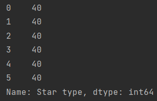
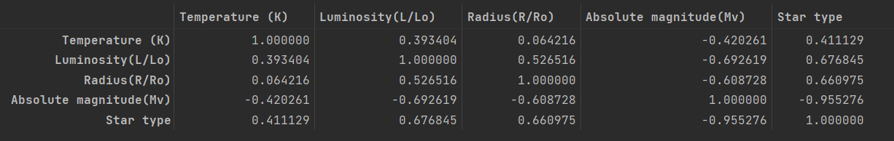
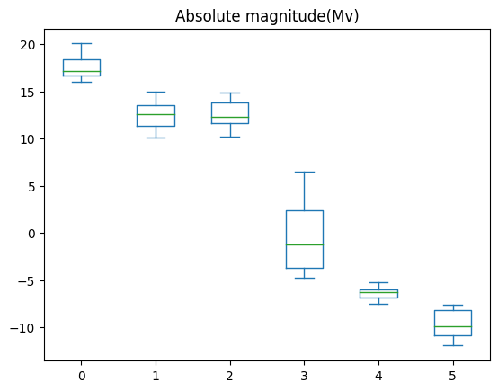
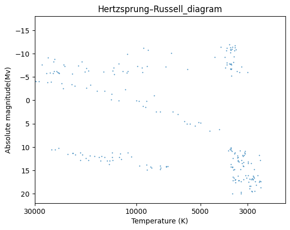

# ACM Research coding challenge (Spring 2023)

- I am pretty new with Data Science, and I learned from mostly the [Pandas](https://pandas.pydata.org/docs/) documentation to answer the question. For machine learning, I used sklearn ensemble Random Forest Classifier ([documentation](https://scikit-learn.org/stable/modules/ensemble.html#random-forests))
- I will answer the question below.
---
### What is the most common star type in the data?
The star type in the data split equally. There are 6 types and each type have 40 stars

### What properties are the most influential in classifying a star's type?

According to the correlation table above, the most influential property is the absolute magnitude. It have the highest negative correlation that is close to 1. We can also check it using the box graph below.

### My attempt at Hertzsprung-Russell Diagram graph

### Train a machine learning model to then predict the star type of a row of data (without the star type field) and find the model's accuracy.

According to this [kaggle notebook](https://www.kaggle.com/code/creepycrap/star-type-pred-100-acc-feat-funkyml), the best model to use is Random Forest Classifier. So I used sklearn ensemble Random Forest Classifier to train the model. I removed Star Color Row and Spectral Class when training. With only 10% of train data set. The model able to predict star type with > 90% accuracy.
